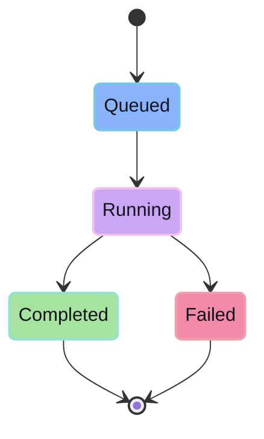

## Endpoints

- `POST /api/agent/sessions`
- `POST /api/agent/sessions/:id/send`
- `GET /api/agent/sessions/:id/stream?projectPath=...&replay=...`
- `DELETE /api/agent/sessions/:id/turn?projectPath=...`
- `DELETE /api/agent/sessions/:id`

## Runtime states

## Output

The agent emits timeline events, tool calls, and diff-producing output for review. Durable mutation happens only through promote.
