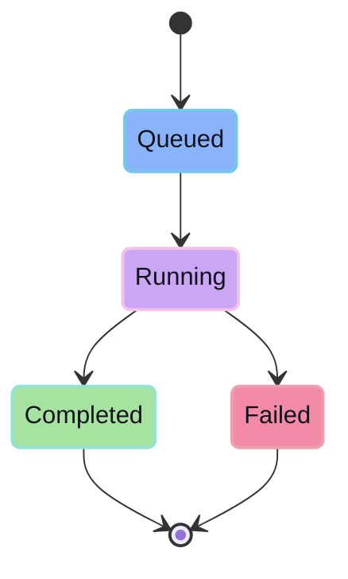

Agent APIs run the work that produces reviewable session output.

## Run shape

```ts
type AgentRun = {
  sessionId: string
  prompt: string
  providerId: string
  modelId: string
}
```

## Runtime states



## Output

The agent should produce session output, logs/events, and a diff. It should not directly mutate durable project state.
