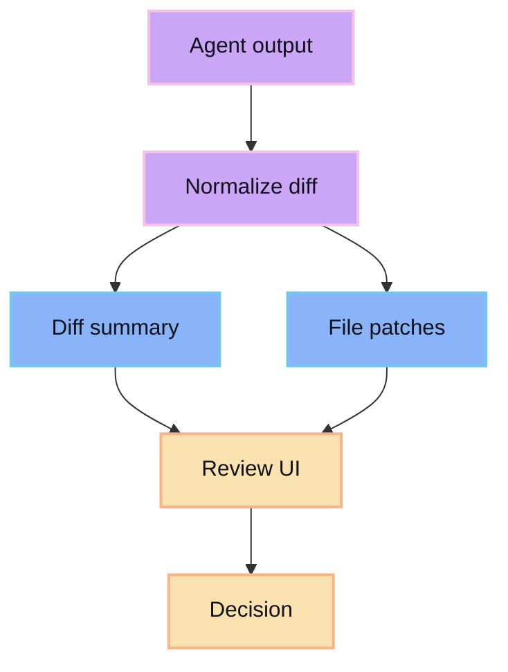

Diff APIs expose generated changes for review and promotion.

## Resource shape

```ts
type DiffSummary = {
  sessionId: string
  filesChanged: number
  additions: number
  deletions: number
  status: 'pending-review' | 'accepted' | 'rejected'
}
```

## Review data

Diff endpoints should make it easy to answer:

- What files changed?
- What lines changed?
- Which changes were accepted?
- Which changes were rejected?
- Is the diff still tied to the current baseline?


