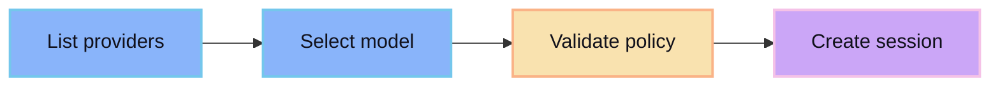

Provider APIs define the available model backends for agent sessions.

## Resource shape

```ts
type Provider = {
  id: string
  label: string
  models: Model[]
  enabled: boolean
}

type Model = {
  id: string
  label: string
  capabilities: string[]
}
```

## Common operations

- List enabled providers.
- List models for a provider.
- Validate a provider/model pair before session creation.
- Record provider/model choice on the session.

## Flow


