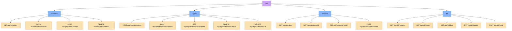

## Endpoints

- `GET /api/providers`
- `PATCH /api/providers/defaults`
- `POST /api/providers/:id/auth`
- `DELETE /api/providers/:id/auth`

## API domain map

```mermaid
flowchart TD
  API["/api"] --> Providers["providers"]
  API --> Agent["agent"]
  API --> Sessions["sessions"]
  API --> Diff["diff"]

  Providers --> P1["GET /api/providers"]
  Providers --> P2["PATCH /api/providers/defaults"]
  Providers --> P3["POST /api/providers/:id/auth"]
  Providers --> P4["DELETE /api/providers/:id/auth"]

  Agent --> A1["POST /api/agent/sessions"]
  Agent --> A2["POST /api/agent/sessions/:id/send"]
  Agent --> A3["GET /api/agent/sessions/:id/stream"]
  Agent --> A4["DELETE /api/agent/sessions/:id/turn"]
  Agent --> A5["DELETE /api/agent/sessions/:id"]

  Sessions --> S1["GET /api/sessions"]
  Sessions --> S2["GET /api/sessions/:id"]
  Sessions --> S3["GET /api/sessions/:id/diff"]
  Sessions --> S4["POST /api/sessions/:id/promote"]

  Diff --> D1["GET /api/diff/sources"]
  Diff --> D2["GET /api/diff/items"]
  Diff --> D3["GET /api/diff/files"]
  Diff --> D4["GET /api/diff/hunks"]
  Diff --> D5["POST /api/diff/pack"]

  classDef root fill:#cba6f7,stroke:#f5c2e7,color:#11111b,stroke-width:2px
  classDef group fill:#89b4fa,stroke:#74c7ec,color:#11111b,stroke-width:2px
  classDef endpoint fill:#f9e2af,stroke:#fab387,color:#11111b,stroke-width:2px

  class API root
  class Providers,Agent,Sessions,Diff group
  class P1,P2,P3,P4,A1,A2,A3,A4,A5,S1,S2,S3,S4,D1,D2,D3,D4,D5 endpoint
```
