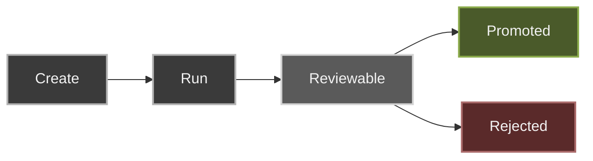

## Endpoints

- `GET /api/sessions`
- `GET /api/sessions?scope=all`
- `GET /api/sessions/:id?projectPath=...`
- `GET /api/sessions/:id/export?format=...`
- `POST /api/sessions/:id/fork`
- `PATCH /api/sessions/:id`
- `DELETE /api/sessions/:id`
- `GET /api/sessions/:id/diff?projectPath=...`
- `POST /api/sessions/:id/promote?projectPath=...`
- `POST /api/sessions/:id/evict`

Session timeline includes user turns, assistant output, tool calls, errors, and turn lifecycle events.

## State flow

