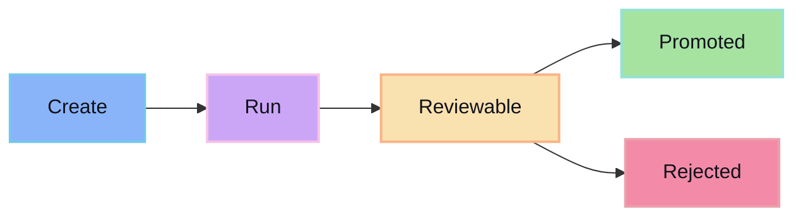

Session APIs create, inspect, and manage agent work sessions.

## Resource shape

```ts
type Session = {
  id: string
  status: 'created' | 'running' | 'reviewable' | 'promoted' | 'rejected'
  providerId: string
  modelId: string
  projectId: string
  createdAt: string
  updatedAt: string
}
```

## Common operations

- Create a session.
- Get session status.
- List session events.
- Request revision.
- Mark review decision.

## State flow


