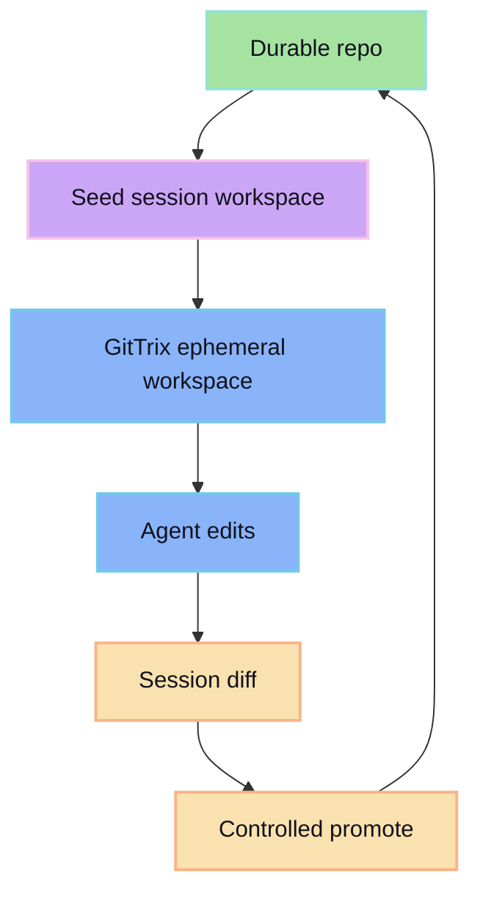

GitTrix provides durable/ephemeral boundary:

- durable: local repo (or configured durable adapter)
- ephemeral: session workspace for agent edits
- promote: controlled copy/commit back to durable

## Durable vs ephemeral boundary

