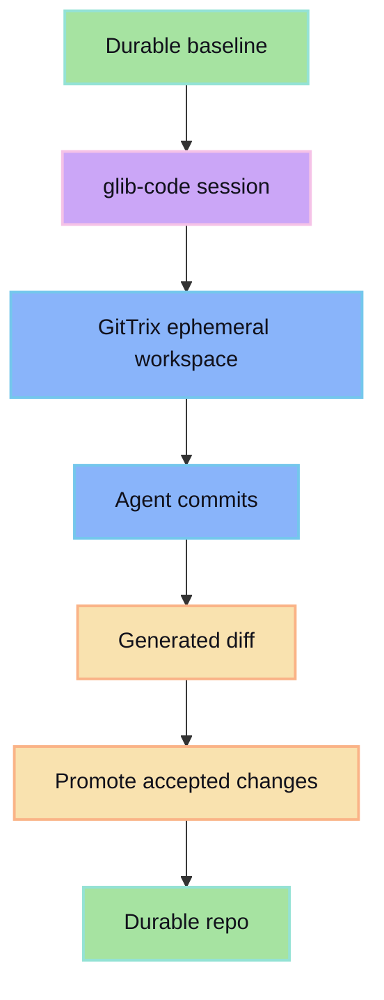

GitTrix isolation keeps generated changes reviewable before they are promoted. glib-code can use GitTrix as the storage boundary between ephemeral agent work and durable project history.

## Boundary

## Responsibilities

- glib-code owns the agent workflow and review surface.
- GitTrix owns the storage isolation and promotion mechanics.
- The human owns the final accept/reject decision.

## Why this split works

The agent gets a real workspace to modify, but the durable repo stays protected until promotion.
