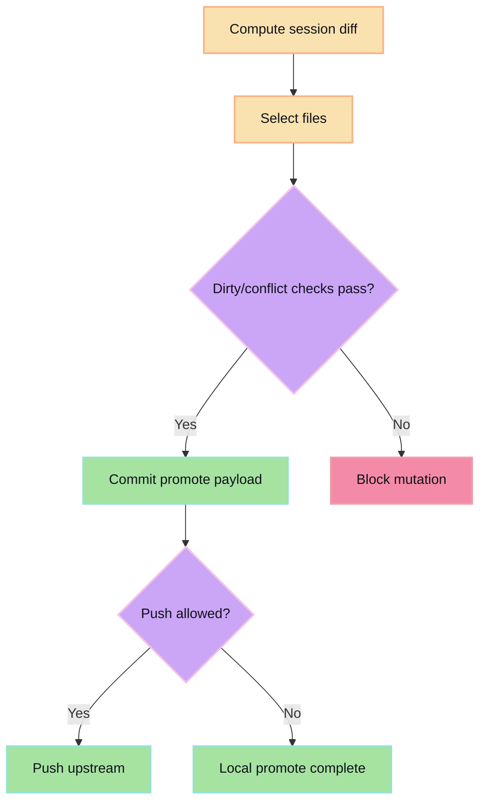

Promote is explicit transfer from ephemeral session workspace to durable repo.

Current flow:

- compute session diff
- select files
- commit promote payload
- optionally push when upstream/backing mode allows

Conflict/dirty protections are enforced before mutation.

## Promote pipeline with safety checks

