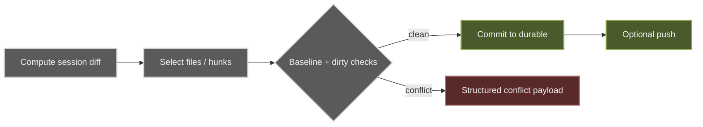

**Promote** is the only path from the ephemeral session workspace to your durable repo. It is always explicit — nothing crosses the boundary automatically.

## Flow

1. Compute the session diff (ephemeral workspace vs durable baseline).
2. Select the files to keep — `Commit all` or `Commit selected`.
3. Guards run before any mutation.
4. Commit the accepted payload to durable; optionally push when the branch has an upstream.

## Guards

- **Baseline drift** returns a `409` with a structured conflict payload rather than clobbering durable state.
- **Dirty durable files** that overlap the promote set are blocked, with stash-and-continue offered.
- Protected `.glib/**` paths are rejected from stage/commit/discard operations.

Durable targets can be your **local repo** or a **GitHub** durable adapter. GitHub promote uses app-managed auth first, then `GITHUB_TOKEN` / `GH_TOKEN` / `gh auth token` fallback.
