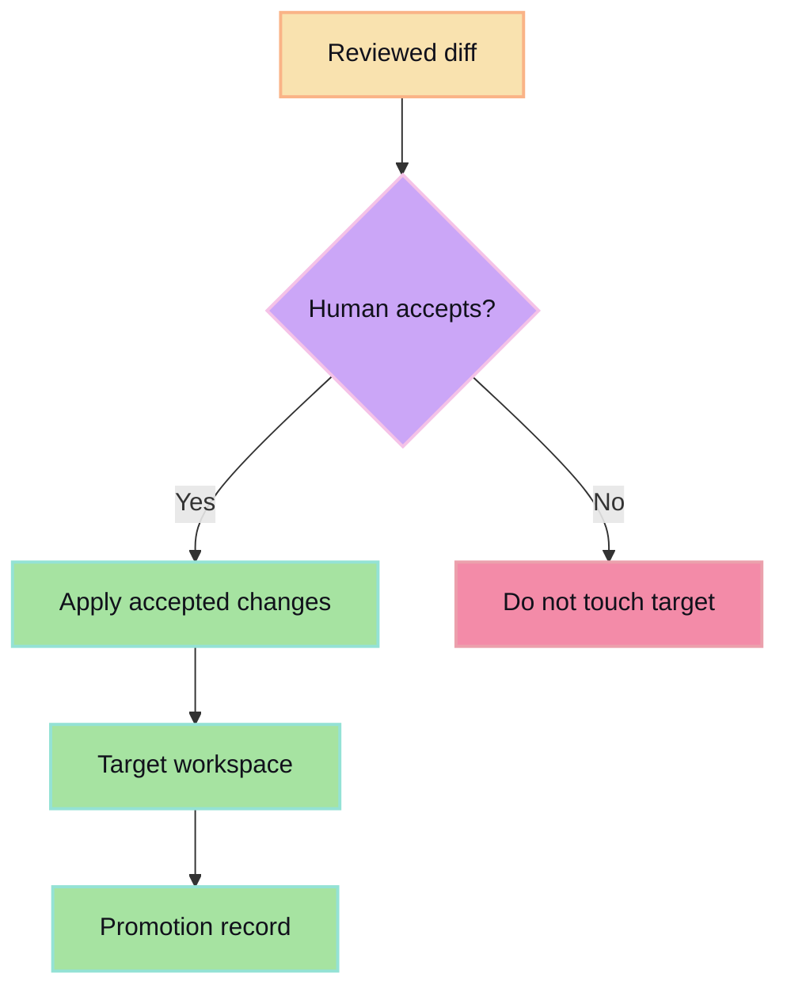

Promotion applies reviewed session output to the destination workspace. It is the point where isolated generated work becomes durable work.

## Promotion gate

## Promotion should preserve

- Which session produced the changes.
- Which diff was accepted.
- Which target workspace received the changes.
- Whether the apply completed cleanly.

## Promotion should not do

- Promote unreviewed work.
- Silently merge conflicts.
- Hide generated changes inside unrelated edits.
- Let providers bypass the human gate.
