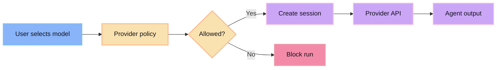

Provider and model authority controls which agent backend is allowed to run a session. The selected provider and model are part of the session boundary, not a hidden global side effect.

## Authority flow

## Why it exists

- Different models have different cost, latency, and quality profiles.
- Some tasks should only run on approved providers.
- Session records should show which backend produced the work.
- Provider permissions should be enforceable before execution.

## Practical rule

If a model choice affects output, cost, permissions, or auditability, it belongs in the session record.
