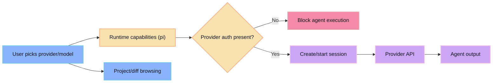

Design rules:

- provider auth is app-managed
- model availability reflects runtime truth
- missing auth blocks agent execution, not project/diff browsing

## Authority decision flow

```mermaid
flowchart LR
  UI["User picks provider/model"] --> Runtime["Runtime capabilities (pi)"]
  Runtime --> Auth{"Provider auth present?"}
  Auth -->|No| Block["Block agent execution"]
  Auth -->|Yes| Session["Create/start session"]
  Session --> Provider["Provider API"]
  Provider --> Output["Agent output"]
  UI --> Browse["Project/diff browsing"]

  classDef input fill:#89b4fa,stroke:#74c7ec,color:#11111b,stroke-width:2px
  classDef policy fill:#f9e2af,stroke:#fab387,color:#11111b,stroke-width:2px
  classDef good fill:#a6e3a1,stroke:#94e2d5,color:#11111b,stroke-width:2px
  classDef bad fill:#f38ba8,stroke:#eba0ac,color:#11111b,stroke-width:2px
  classDef core fill:#cba6f7,stroke:#f5c2e7,color:#11111b,stroke-width:2px

  class UI,Browse input
  class Runtime,Auth policy
  class Session,Provider,Output core
  class Block bad
```
