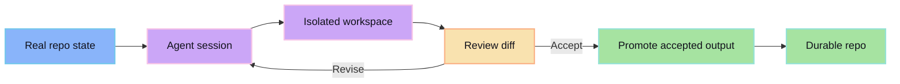

Core loop:

1. Start from real repo state
2. Run agent in isolation
3. Review diff
4. Promote accepted output
5. Keep durable repo clean

```mermaid
flowchart LR
  Baseline["Real repo state"] --> Session["Agent session"]
  Session --> Work["Isolated workspace"]
  Work --> Diff["Review diff"]
  Diff -->|Accept| Promote["Promote accepted output"]
  Diff -->|Revise| Session
  Promote --> Durable["Durable repo"]

  classDef input fill:#89b4fa,stroke:#74c7ec,color:#11111b,stroke-width:2px
  classDef session fill:#cba6f7,stroke:#f5c2e7,color:#11111b,stroke-width:2px
  classDef review fill:#f9e2af,stroke:#fab387,color:#11111b,stroke-width:2px
  classDef done fill:#a6e3a1,stroke:#94e2d5,color:#11111b,stroke-width:2px
  classDef reject fill:#f38ba8,stroke:#eba0ac,color:#11111b,stroke-width:2px

  class Baseline input
  class Session,Work session
  class Diff review
  class Promote,Durable done
```
