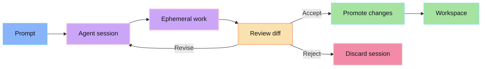

The review-first loop keeps generated work separate from accepted work until the diff has been inspected.

The loop is intentionally boring: start a session, let the agent work, review the diff, then either promote or revise. Anything else is how agent workflows turn into cleanup workflows.

## Steps

### 1. Start a session

A session captures the task, model/provider choice, project context, and working boundary.

### 2. Generate isolated work

The agent edits inside an isolated workspace. The real repo is not the write target.

### 3. Review the diff

The human reviews the generated output as a proposal. This is the control point.

### 4. Promote accepted changes

Promotion applies only the accepted output to the target workspace.

## Bad signs

- The agent can write directly to durable state.
- The review happens after changes are already mixed into the repo.
- Rejected work has to be manually untangled.
- Provider/model choice is hidden from the session record.
