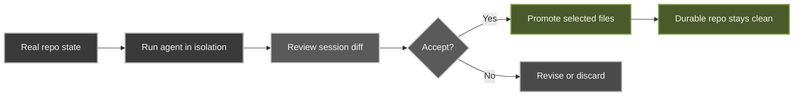

The review-first loop is glib-code's core contract. The agent produces a **proposal**, not a direct mutation. You review it, then promote only what you accept.

1. **Start from real repo state.** Browse working-tree and commit diffs before prompting — no provider key needed for this.
2. **Run the agent in isolation.** Edits land in an ephemeral GitTrix workspace, never your durable checkout.
3. **Review the diff.** The full session diff shows exactly what changed, file by file.
4. **Promote accepted output.** Commit only the files you keep; optionally push.
5. **Durable history stays clean.** Bad generations are cheap to discard; good ones are easy to promote.
