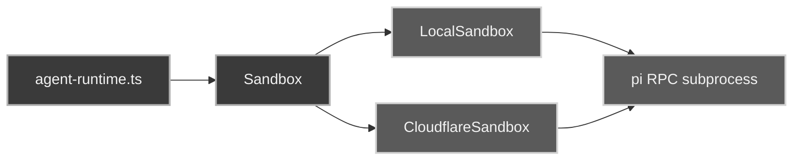

The **sandbox** owns *where* the `pi` agent runs. It is separate from the workspace boundary: GitTrix still owns storage and [promote](/concepts/promote/), the sandbox just owns execution.

Consumers receive a generic `Sandbox` and never branch on local vs hosted.

## Implementations

- **LocalSandbox** wraps local process spawn and filesystem access. Its cwd is the GitTrix local ephemeral workspace.
- **CloudflareSandbox** wraps the Cloudflare Sandbox SDK. Its cwd is sandbox-local (`/workspace`); the hosted sync/promote path is downstream and still in progress.

## Runtime model

- Agent execution uses **pi RPC** over LF-delimited JSONL by default, not an in-process SDK. Set `GLIB_PI_RUNTIME=sdk` for the legacy fallback during parity testing.
- `runTurn` runs with cwd set to the session's git-backed ephemeral path when `.git` exists there; otherwise it falls back to the durable repo path so shell git commands don't fail.
- Agent prompts carry repo/session metadata — durable path, actual cwd, ephemeral workspace, git-backed state, and baseline SHA — so the model can tell them apart.

## Failure modes

- `SANDBOX_START_FAILED` — sandbox creation failed.
- `SANDBOX_PI_MISSING` — pi binary missing or spawn failure.
- `pi_crashed` — pi exited mid-turn; surfaced as a canonical error event.
- If pi exits *between* turns, the next turn respawns it inside the same sandbox path.

Abort writes an abort command to pi's stdin; it does not kill the subprocess. Deleting a session disposes the RPC client and destroys the sandbox.
