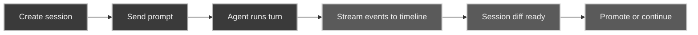

A **session** is one unit of agent work: a persisted timeline plus a mapping to an isolated workspace.

Each glib session is paired with a GitTrix session. GitTrix returns an `ephemeralPath` — a git-backed worktree (with clone fallback) where the agent's edits land. Accepted changes only reach durable through [promote](/concepts/promote/).

## Lifecycle

## Timeline

The session timeline persists user turns, assistant output, tool calls, errors, and turn lifecycle events. Tool-call cards classify diff / code / json / terminal / tree / error output and hide raw payloads behind an Inspect affordance.

## Persistence and resolution

- Session metadata and event logs live in repo-local `.glib/sessions`.
- A session-id → durable project-path index lives in app config (`sessions-index.json`).
- Session-scoped calls send `projectPath` so the backend resolves sessions correctly after reloads, project switches, or stale index state.

Live subprocesses and sandboxes do not survive a server restart — the first send after restart spins up a fresh runtime for the existing session metadata.

Prompts complete on the agent's `agent_end` signal; a `turn_end` is only one model/tool cycle and does not end the glib turn.
