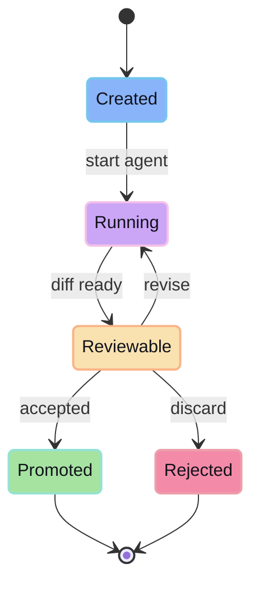

A session is the unit of agent work in glib-code. It ties together the prompt, selected provider/model, workspace boundary, generated changes, review state, and promotion result.

## Lifecycle

## What belongs in a session

- The user task and current prompt trail.
- Provider/model authority for the run.
- Project identity and baseline reference.
- Generated file changes.
- Review status.
- Promotion metadata.

## Why sessions matter

Sessions make generated work auditable. Instead of asking “what did the agent just do to my repo,” you can inspect one bounded unit of work and decide what happens next.
