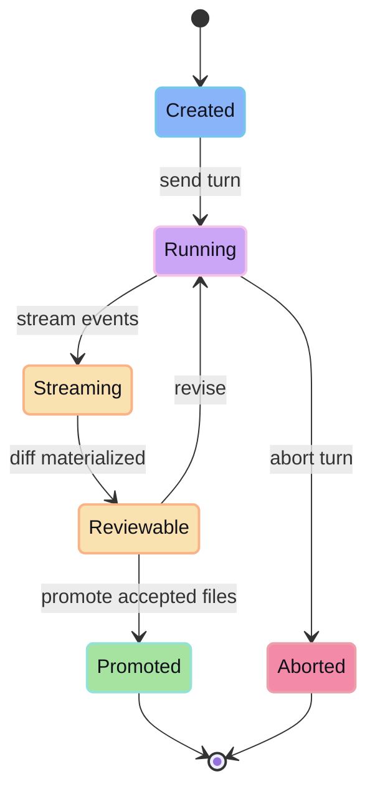

Session = unit of agent work + timeline + isolated workspace mapping.

Current behavior:

- create: `POST /api/agent/sessions`
- send: `POST /api/agent/sessions/:id/send`
- stream: `GET /api/agent/sessions/:id/stream`
- abort: `DELETE /api/agent/sessions/:id/turn`
- delete: `DELETE /api/agent/sessions/:id`

Session timeline includes user turns, assistant output, tool calls, errors, and turn lifecycle events.

## Session lifecycle

