1. Open or clone a repository.
2. Choose **Diffs** or **Session** entry mode.
3. In Diffs mode, review working tree/commit diffs.
4. Start or continue a session.
5. Let the agent work in isolated GitTrix workspace.
6. Review session-produced diff.
7. Promote approved files back to durable repo.

```mermaid
flowchart LR
  Repo["Open/Clone Repo"] --> Mode{"Choose mode"}
  Mode --> Diffs["Diffs mode"]
  Mode --> Session["Session mode"]
  Diffs --> ReviewBase["Review baseline diffs"]
  Session --> Start["Start/continue session"]
  ReviewBase --> Start
  Start --> Work["Agent writes in GitTrix ephemeral workspace"]
  Work --> Review["Review session diff"]
  Review --> Promote["Promote approved files"]
  Promote --> Durable["Durable repo"]

  classDef surface fill:#89b4fa,stroke:#74c7ec,color:#11111b,stroke-width:2px
  classDef core fill:#cba6f7,stroke:#f5c2e7,color:#11111b,stroke-width:2px
  classDef review fill:#f9e2af,stroke:#fab387,color:#11111b,stroke-width:2px
  classDef durable fill:#a6e3a1,stroke:#94e2d5,color:#11111b,stroke-width:2px

  class Repo,Mode,Diffs,Session surface
  class Start,Work core
  class ReviewBase,Review,Promote review
  class Durable durable
```

Use [Review-first loop](/concepts/review-first/) for the core workflow contract.
