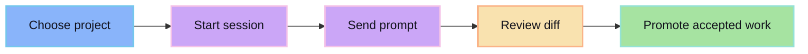

Start a session, let the agent produce changes, review the diff, then promote the accepted work.

## Workflow

## First session checklist

1. Pick the project you want the agent to work against.
2. Pick the provider/model for the run.
3. Describe the task narrowly.
4. Wait for a reviewable diff.
5. Promote only what you want to keep.

## Prompting rule

Ask for one reviewable change at a time. Big vague prompts create big vague diffs.
