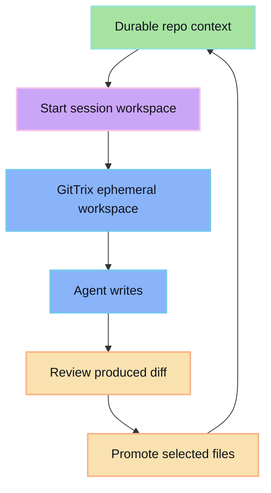

Use GitTrix as isolation boundary:

- start session workspace from durable repo context
- run agent writes only in ephemeral workspace
- review produced diff
- promote selected files back to durable

## Integration shape

