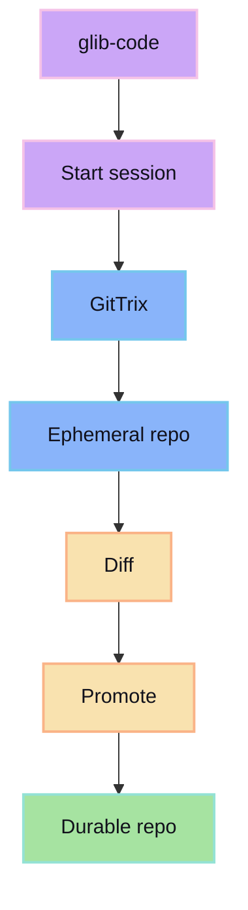

GitTrix provides isolated workspaces for review-first agent changes.

## Integration shape

## Contract

- glib-code asks for an isolated session workspace.
- GitTrix provides the ephemeral storage boundary.
- The agent writes inside that boundary.
- glib-code shows the diff for review.
- GitTrix promotes accepted changes to durable storage.

## Result

The agent gets freedom inside the session, while durable project history stays controlled by the human review gate.
