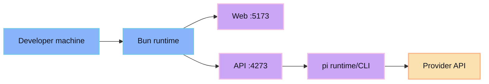

Requirements:

- Bun
- Git
- pi runtime/CLI
- provider key for agent sessions

Commands:

```bash
bun install
bun run dev
```

Defaults:

- API: `http://127.0.0.1:4273`
- Web: `http://127.0.0.1:5173`


