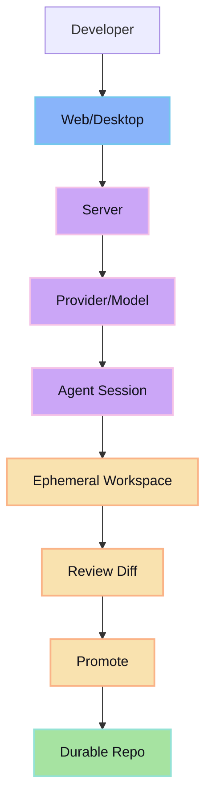

glib-code is a review-first coding workflow for shipping agent-written changes without losing control of your repo.

Agents can generate quickly. The failure mode is letting generated edits touch durable git state before review. glib-code fixes that by isolating agent work, rendering changes as diffs, and only promoting accepted output.

## Architecture

The review boundary is between session workspace and durable repo.

## Product principles

- review first
- isolate agent edits
- explicit promote to durable git
- runtime-truth provider/model authority
- avoid hidden side effects

## Current priorities

- richer typed tool artifacts and timeline components
- less raw output in default UI paths
- promote ergonomics (finer-grained selection)
- resilience under reconnect/restart/multi-session load

## Where to go next

- [Why glib-code](/why/)
- [Getting Started](/getting-started/)
- [Review-first loop](/concepts/review-first/)
