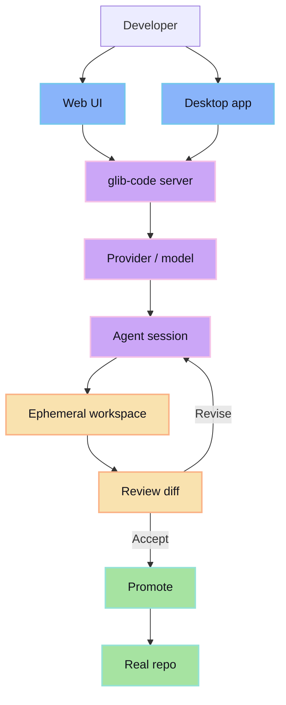

glib-code is a review-first coding workflow for shipping agent-written changes without losing control of the diff.

Agents can write code fast. The problem is not generation speed; the problem is letting generated work touch the real repo before it has been reviewed. glib-code keeps agent work isolated, turns it into a reviewable diff, and only promotes the accepted output.

## System overview

## What glib-code gives you

- A session boundary for every agent task.
- Provider/model selection that is explicit instead of ambient.
- Reviewable diffs before changes are promoted.
- A clean handoff from isolated work to the real workspace.
- Surfaces for web, server, and desktop workflows.

## Mental model

1. Start a session from a real project state.
2. Let the agent work in isolation.
3. Review the resulting diff.
4. Promote only the changes you accept.
5. Keep the durable repo clean.

## Where to go next

- [Why glib-code](/why/) explains the problem it solves.
- [Review-first loop](/concepts/review-first/) covers the core workflow.
- [Sessions](/concepts/sessions/) explains the unit of agent work.
- [Web](/surfaces/web/), [Server](/surfaces/server/), and [Desktop](/surfaces/desktop/) cover the three surfaces.
