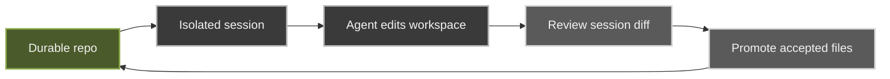

glib-code is a local-first AI coding workspace with one hard rule: **agent writes happen outside your durable repo until you review and promote them.**

Open a project, start a session, let the agent work in an isolated sandbox, review exactly what changed, then apply only the files you accept back to your real checkout.

## The loop

The review boundary sits between the ephemeral session workspace and your durable repo. Nothing crosses it without an explicit promote.

## Main parts

- **Frontend** — Vue/Vite web UI wrapped by an Electron desktop shell. Owns the session timeline, diff review, and promote UI.
- **Backend** — Bun/Hono API server for repo access, git mutations, sessions, settings, auth, and SSE event streams.
- **Agent runtime** — the `pi` agent running as an RPC subprocess inside a sandbox.
- **Workspace boundary** — GitTrix creates the ephemeral session workspace and promotes accepted changes back to durable.
- **Durable repo** — your real checkout, or a GitHub durable target.

## Product principles

- review first, not prompt-first
- isolate agent edits from durable git state
- explicit promote — accepted changes only
- runtime-truth provider/model authority (no static catalog)
- no hidden side effects

## Where to go next

- [Why glib-code](/why/)
- [Getting Started](/getting-started/)
- [Review-first loop](/concepts/review-first/)
