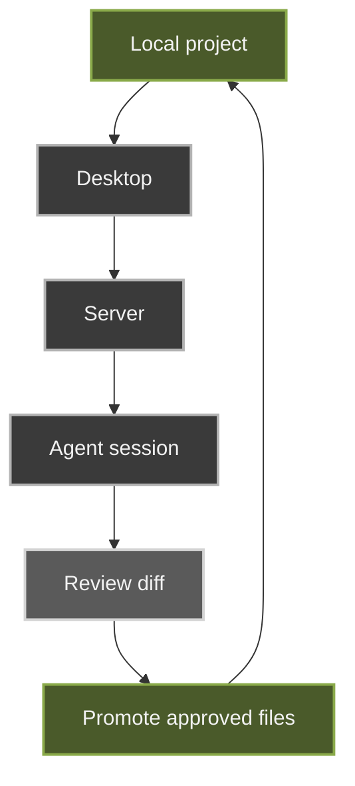

Electron shell wrapping web/server workflow with native integrations (for example, folder picker).

## Focus

- local project selection
- native filesystem affordances
- same review-first/promotion workflow as web

