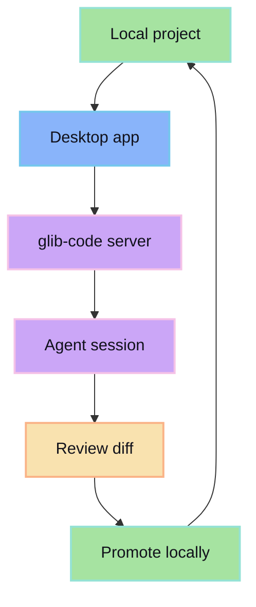

The desktop surface connects local projects to the review-first glib-code workflow. It is for developers who want agent sessions close to their local workspace without giving the agent unrestricted write access.

## What it should do

- Detect and register local projects.
- Start sessions from a selected workspace.
- Display local-aware review state.
- Promote accepted changes into the local project.
- Keep server/provider settings visible.

## Desktop invariant

The desktop app can be close to the filesystem, but the review gate still has to stay in front of promotion.
