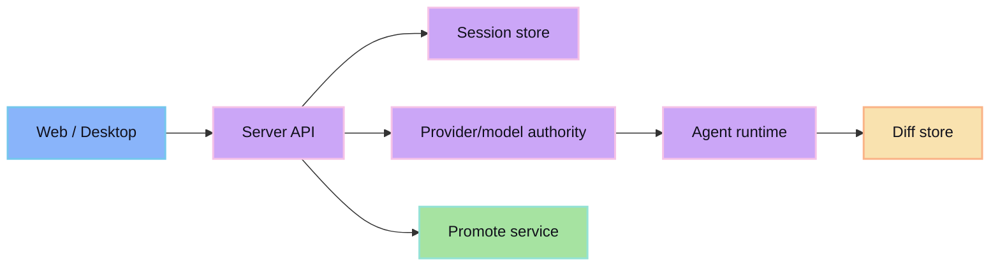

Bun/Hono API for sessions, agent runtime, diff, providers, and promote.

## Responsibilities

- session metadata/event persistence
- SSE replay + stream
- agent event normalization
- structured tool result typing (`resultType`, `summary`, `artifact`)
- GitTrix session orchestration

