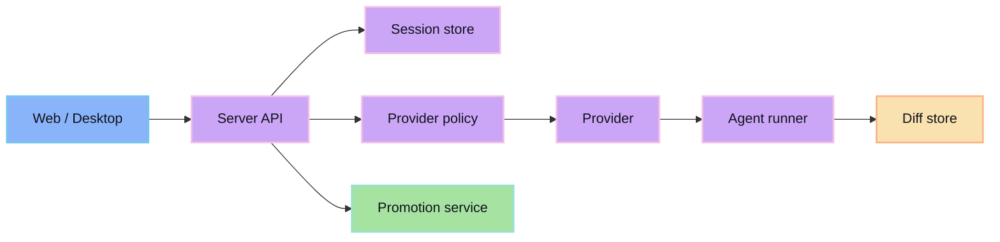

The server coordinates session state, provider execution, diff storage, and promotion requests. It is the control plane for the review-first workflow.

## Responsibilities

- Create and track sessions.
- Enforce provider/model authority.
- Dispatch agent work.
- Store session output and diff metadata.
- Validate and execute promotion requests.

## Server invariant

No promotion should run without a session, a diff, and an explicit accept decision.
