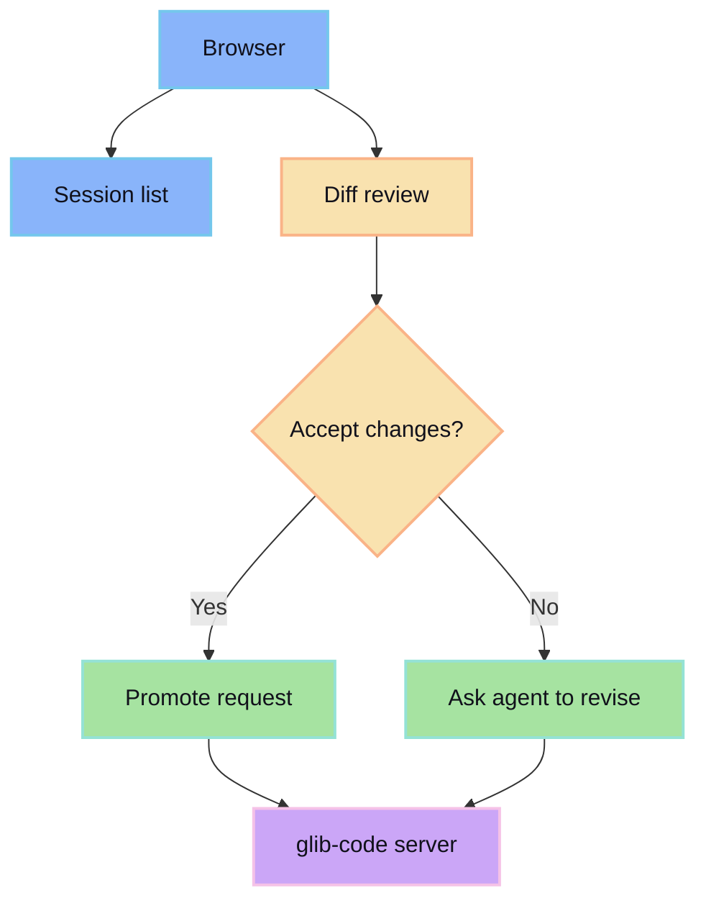

The web surface is the browser UI for managing sessions, reviewing diffs, and promoting accepted work.

## What it owns

- Starting and resuming sessions.
- Showing agent progress.
- Rendering reviewable diffs.
- Capturing accept/reject decisions.
- Calling server APIs for promotion.

## Design rule

The web app should make the review gate obvious. If the user cannot tell whether work has been promoted, the UI is wrong.
