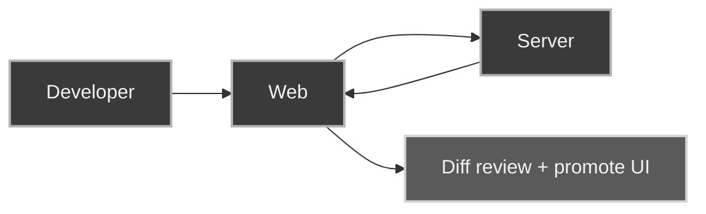

Vue/Vite app for project picker, diff workbench, sessions, and promote UI.

## Key UX points

- mode selection on project open (Diffs vs Session)
- inline mode cards in recent projects
- typed tool-call rendering in timeline
- diff rendering through Pierre (`@pierre/diffs`)
- in-app destructive confirmations (session delete)

