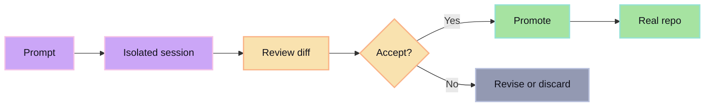

Most agent tools are prompt-first and review-later.

glib-code is review-first by design:

- inspect real diffs before and after agent work
- keep agent writes isolated from durable repo
- require explicit promotion of accepted changes
- keep provider/model choice explicit, not ambient
- allow diff/project workflows without provider keys

## Prompt-first failure mode

Direct agent writes make it too easy to pollute working directories, branch history, and review flow. Once generated changes are mixed into durable work, the human has to clean up after the agent instead of reviewing a controlled proposal.

## Review-first path

glib-code makes the agent produce a proposal instead of directly mutating durable state. The human reviews the proposal, then promotes it if it is worth keeping.

## Outcome

- agent output stays reviewable
- human approval remains the gate
- durable history stays cleaner
- bad generations are cheap to discard
- good generations are easy to promote
