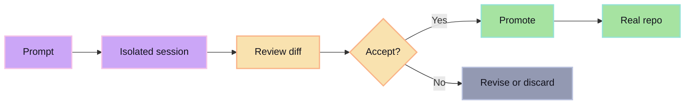

glib-code is built around one rule: review comes before promotion.

Agents can explore, edit, and propose changes, but those changes should not land in the real repo by default. glib-code gives generated work a safe place to exist until a human accepts it.

## The failure mode

Direct agent writes make it too easy to pollute working directories, branch history, and review flow. Once generated changes are mixed into durable work, the human has to clean up after the agent instead of reviewing a controlled proposal.

## The glib-code path

glib-code makes the agent produce a proposal instead of directly mutating durable state. The human reviews the proposal, then promotes it if it is worth keeping.

## Why this matters

- Agent output stays reviewable.
- Human approval remains the gate.
- Durable history stays cleaner.
- Bad generations are cheap to throw away.
- Good generations are easy to promote.
